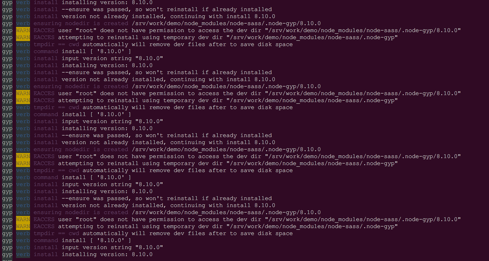
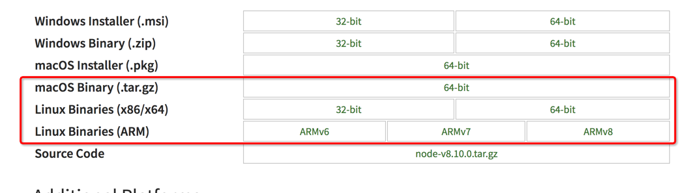

## node-sass安装失败引发的思考


在mac OS或liunx系统下，有时候在安装node-sass时会出现，`Permissions Errors`

可能出现的情况是这样:



------

**阅读后你将得到什么**

>   1. 你将成功的解决node-sass安装不了苦恼（相同或类似的问题）
>   2. 不仅仅是node-sass，其他模块如此类问题，同样可以解决
>   3. 你将获得处理此类问题的，多种解决方案
>   4. 你将了解到出现此类问题的原因，以及如何避免此类问题


## 错误分析

找到输出信息里的关键词`user "root" does not have permission to access the dev dir`

貌似是权限问题，但有时候是`root`用户了，为什么会有权限问题？


解决问题的方案有下面几种：

## 方案一 添加参数（--unsafe-perm）

在安装`node-sass`时，使用参数`--unsafe-perm`

例如：

```
npm install --unsafe-perm node-sass
```

解析：

`--unsafe-perm` 在root下默认值为false,其他的默认值为true

设置为true,在run package script时会切换UID/GID
明确设置为false,在非root用户下安装会失败


## 方案二 添加参数(--user=root)

在安装`node-sass`时，使用参数`--user=root`

例如：

```
npm install --user=root node-sass
```
该参数指定了再执行脚本时使用的账号(UID),默认是`nobody`      

## 方案四 修改现有node的权限

如果你是直接使用了已经编译后的node版本



那么你解压之后的目录权限可能是这样的

```
drwxrwxr-x  7 dev  dev  4.0K 3月  24 11:25 node-v8.10.0-linux-x64
```
也可能是这样的

```
drwxrwxr-x  7 500  500  4.0K 3月  24 11:25 node-v8.10.0-linux-x64
```

这里就需要修改node目录的权限为`root`

```
chown root:root node-v8.10.0-linux-x64
```

## 方案四 重新安装node(推荐使用nvm)

这是直接贴上nvm地址，如何安装[看文档](https://github.com/creationix/nvm)


## 方案五 npm提供的解决方案（How to Prevent Permissions Errors）

```
 ## 创建.npm-global目录
 mkdir ~/.npm-global
 ## 设置
 npm config set prefix '~/.npm-global'
 export PATH=~/.npm-global/bin:$PATH
 source ~/.profile

```

通过上述方法的其中一种，就可以解决问题。

## 参考

* [unsafe-perm](https://docs.npmjs.com/misc/config#unsafe-perm)
* [fixing-npm-permissions](https://docs.npmjs.com/getting-started/fixing-npm-permissions)
* [npx](https://medium.com/@maybekatz/introducing-npx-an-npm-package-runner-55f7d4bd282b)